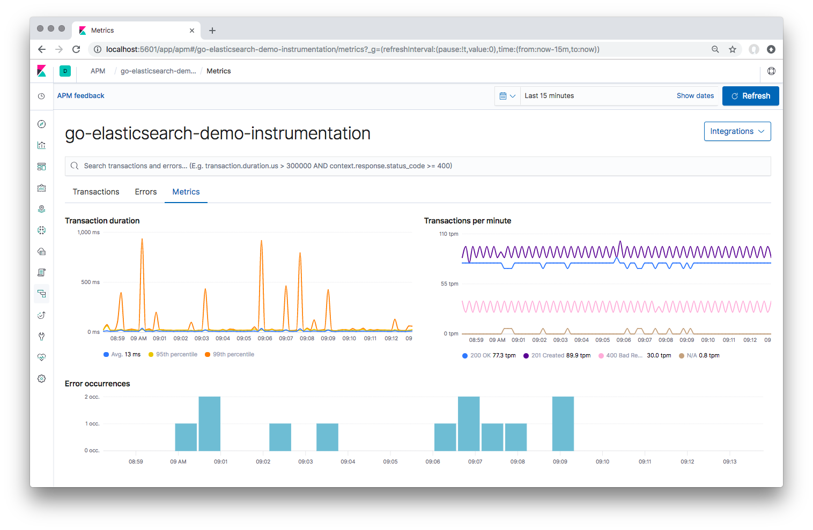

# Example: Instrumentation

This example demonstrates how to instrument the Elasticsearch client.

### OpenCensus

The [**`opencensus.go`**](./opencensus.go) example uses the [`ochttp.Transport`](https://godoc.org/go.opencensus.io/plugin/ochttp#example-Transport) wrapper to auto-instrument the client calls, and provides a simple exporter which prints information to the terminal.

### Elastic APM

The [**`apmelasticsearch.go`**](./apmelasticsearch.go) example demonstrates instrumenting the client with the [Go agent for Elastic APM](https://github.com/elastic/apm-agent-go): configuring the transactions for multiple types, creating custom spans within a transaction, and reporting errors.

Run the example interactively with Docker and inspect the UI in <a href="http://localhost:5601/app/apm#/go-elasticsearch-demo-instrumentation/transactions?_g=(time:(from:now-15m,to:now))">Kibana</a>:

    docker-compose --file elasticstack.yml up --build
